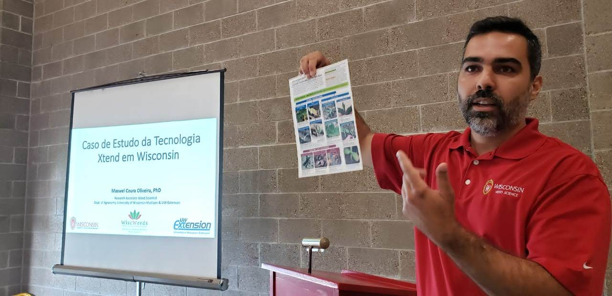
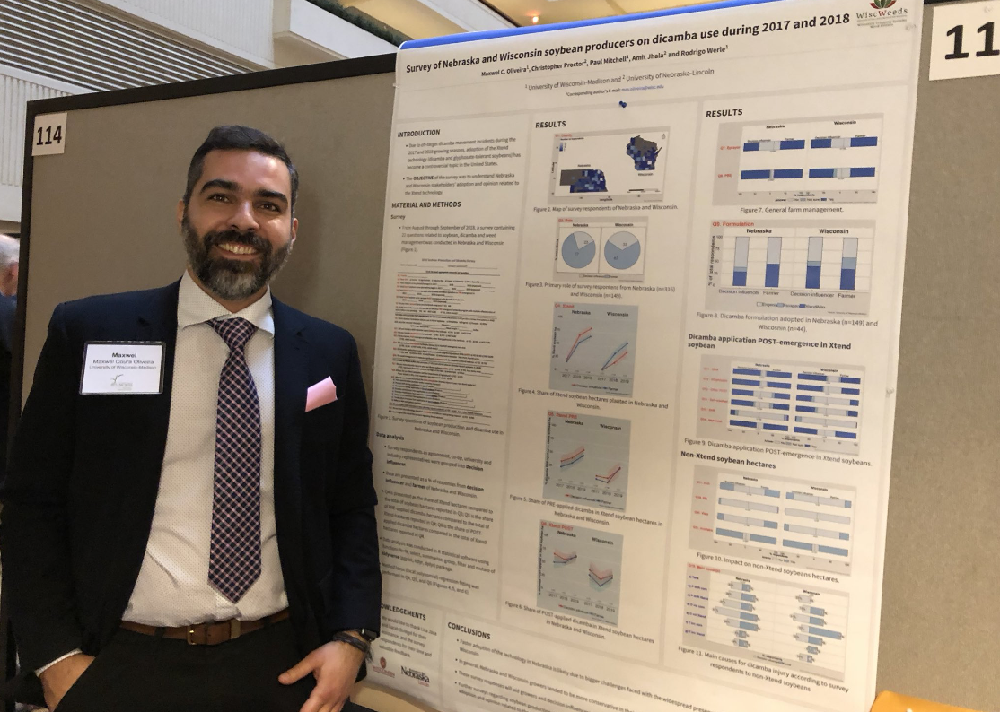
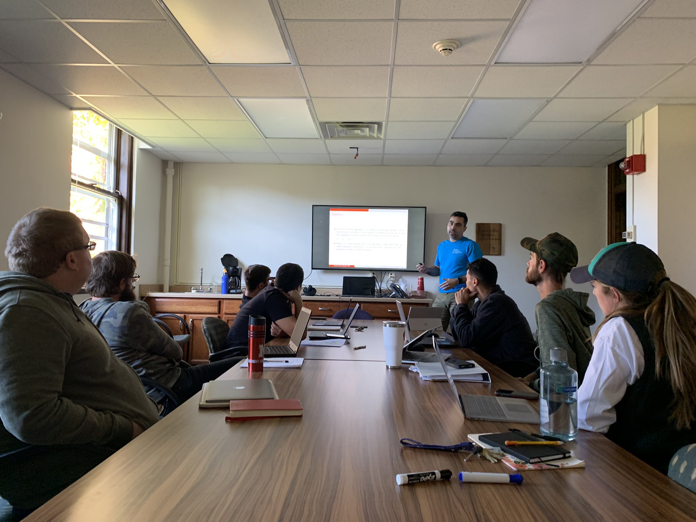
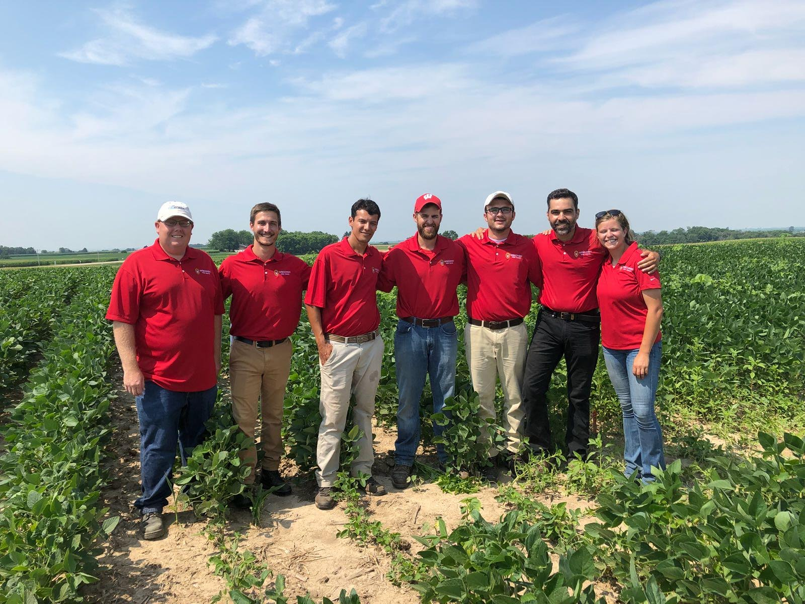

+++
# A Demo section created with the Blank widget.
# Any elements can be added in the body: https://sourcethemes.com/academic/docs/writing-markdown-latex/
# Add more sections by duplicating this file and customizing to your requirements.

widget = "blank"  # See https://sourcethemes.com/academic/docs/page-builder/
headless = true  # This file represents a page section.
active = true # Activate this widget? true/false
weight = 20  # Order that this section will appear.

title = ""
subtitle = ""

[design]
  # Choose how many columns the section has. Valid values: 1 or 2.
  columns = "1"

[design.background]
  # Apply a background color, gradient, or image.
  #   Uncomment (by removing `#`) an option to apply it.
  #   Choose a light or dark text color by setting `text_color_light`.
  #   Any HTML color name or Hex value is valid.

  # Background color.
  # color = "navy"
  
  # Background gradient.
  # gradient_start = "DeepSkyBlue"
  # gradient_end = "SkyBlue"
  
  # Background image.
  image = ""  # Name of image in `static/img/`.
  image_darken = 0.6  # Darken the image? Range 0-1 where 0 is transparent and 1 is opaque.

  # Text color (true=light or false=dark).
  text_color_light = false

[design.spacing]
  # Customize the section spacing. Order is top, right, bottom, left.
  padding = ["20px", "0", "20px", "0"]

[advanced]
 # Custom CSS. 
 css_style = ""
 
 # CSS class.
 css_class = "mini"
+++

I am from Ipatinga, Minas Gerais. I have a BSc in Agronomy and a MSc in Plant Science at the [Universidade Federal dos Vales do Jequitinhonha e Mucuri](http://www.ufvjm.edu.br/). I received my PhD in Agronomy & Weed Science at the [University of Nebraska-Lincoln](https://www.unl.edu/) in 2017. 

My first experience in the United States was during my undergraduate period. I have completed a 12 month on job training in the United States through [The Ohio Program](https://top.osu.edu/). I have worked in a specialty crop farm in Michigan, and in a hydroponic tomato greenhouses in New York.

My [research](https://profiles.impactstory.org/u/0000-0001-5398-1234) is focused on modeling weed management in agro and natural ecosystems. I have written and collaborated in many scientific [publications](/publication) about surveys, management, ecology, biology and resistance of weeds. I have also presented and collaborated to research/extension posters and talks in international conferences.

In Nebraska, I started to analyze my research studies with the statistical programming language SAS and R. I became an avid user of R. I have taught R in workshops and I current teach R classes to graduate students.

I currently work remotely for the University of Wisconsin-Madison and a consultant on weed management and data analysis. 

Thank you so much for reading.
