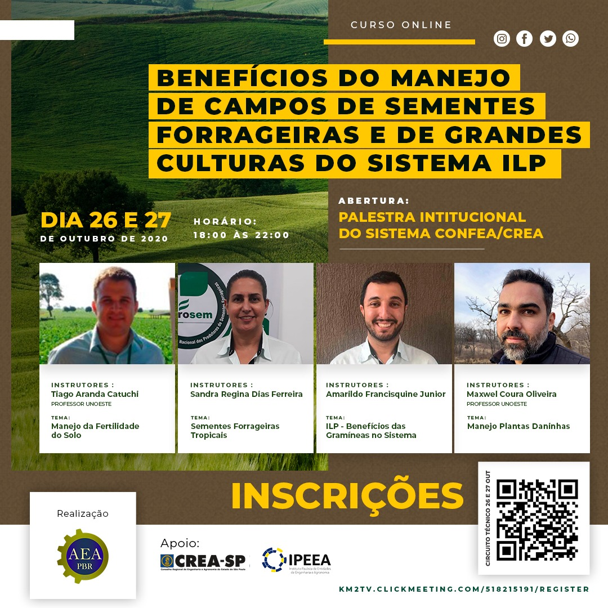

> This workshop was organized by the Agronomist Association of de Presidente Bernardes with support of CREA-SP and IPEEA. Event using the Portuguese language.

In this lecture, I talked about the basic concepts of weeds oand the processes to weed invasion, especially in forage grass crops. As well as integrated weed/invasive management tools for forage grasses.

