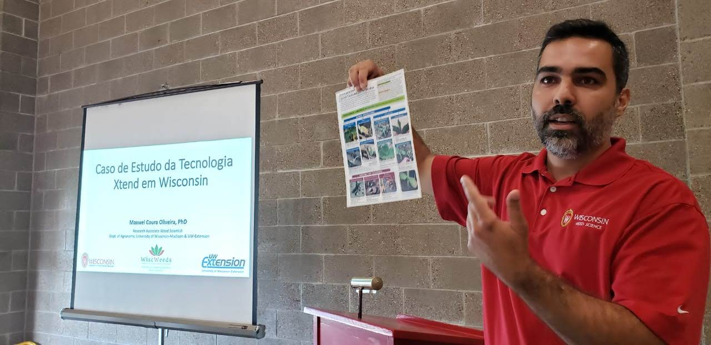
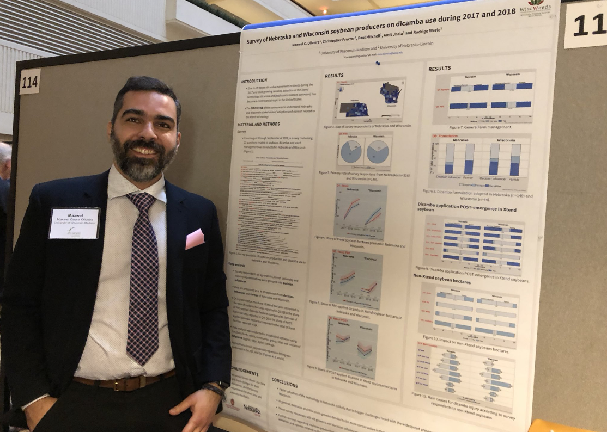
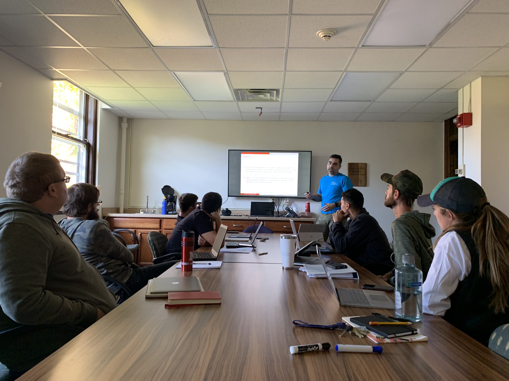
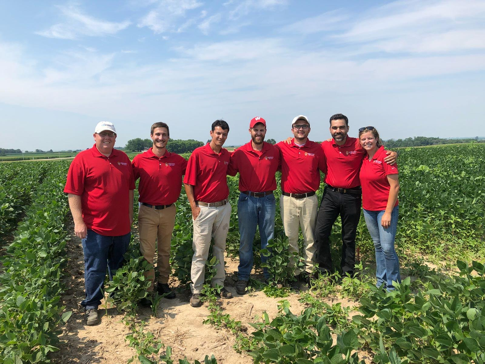

+++
# A Demo section created with the Blank widget.
# Any elements can be added in the body: https://sourcethemes.com/academic/docs/writing-markdown-latex/
# Add more sections by duplicating this file and customizing to your requirements.

widget = "blank"  # See https://sourcethemes.com/academic/docs/page-builder/
headless = true  # This file represents a page section.
active = true # Activate this widget? true/false
weight = 20  # Order that this section will appear.

title = ""
subtitle = ""

[design]
  # Choose how many columns the section has. Valid values: 1 or 2.
  columns = "1"

[design.background]
  # Apply a background color, gradient, or image.
  #   Uncomment (by removing `#`) an option to apply it.
  #   Choose a light or dark text color by setting `text_color_light`.
  #   Any HTML color name or Hex value is valid.

  # Background color.
  # color = "navy"
  
  # Background gradient.
  # gradient_start = "DeepSkyBlue"
  # gradient_end = "SkyBlue"
  
  # Background image.
  image = ""  # Name of image in `static/img/`.
  image_darken = 0.6  # Darken the image? Range 0-1 where 0 is transparent and 1 is opaque.

  # Text color (true=light or false=dark).
  text_color_light = false

[design.spacing]
  # Customize the section spacing. Order is top, right, bottom, left.
  padding = ["20px", "0", "20px", "0"]

[advanced]
 # Custom CSS. 
 css_style = ""
 
 # CSS class.
 css_class = "mini"
+++

Eu sou natural de Ipatinga, Minas Gerais. Estudei Agronomia na graduação e mestrado em Produção Vegetal na [Universidade Federal dos Vales do Jequitinhonha e Mucuri](http://www.ufvjm.edu.br/). Recebi meu PhD em Agronomia & Planta Daninha na Universidade de Nebraska-Lincoln em 2017. Também, durante a graduação fiz intercâmbio nos Estados Unidos pelo [The Ohio Program](https://top.osu.edu/).

Minha [pesquisa](https://profiles.impactstory.org/u/0000-0001-5398-1234) é focada no manejo de plantas daninhas em agro e ecossistemas naturais. Eu escrevi e colaborei em muitas [publicaçōes](/pt/publication) cietíficas sobre avaliaçōes, manejo, ecologia, biologia e resistência de plantas daninhas. Tambem aprensentei e colaborei em vários trabalhos em conferências internacionais.

Em Nebraska, comecei a analisar meus experimentos com programas estatísticos da linguaguem SAS e R. Desenvolvi uma paixão pela linguagem R, sendo que já ministrei [workshops](/categories/workshop/) em congresso e dou aulas para pós-graduação com o tema R.

Atualmente trabalho remotamente para a Universidade de Wisconsin-Madison e sou professor de Biologia e Manejo de Planta Daninha e Programação em R na Universidade do Oeste Paulista.

Muito obrigado por lêr.