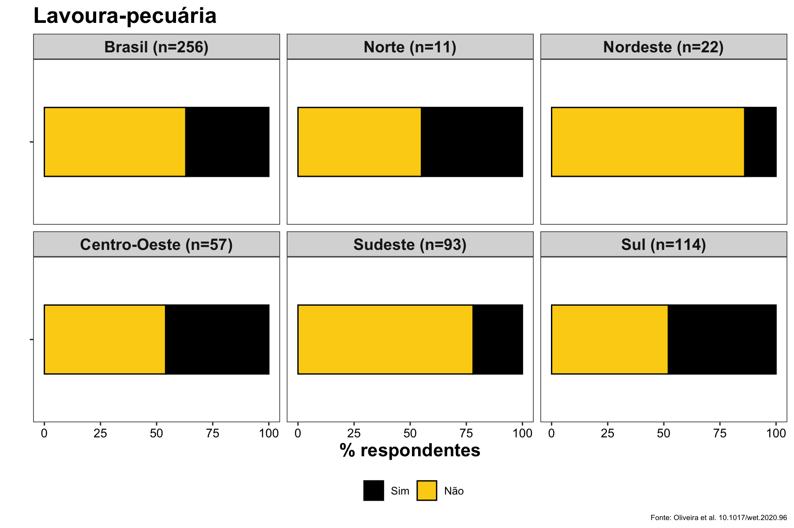
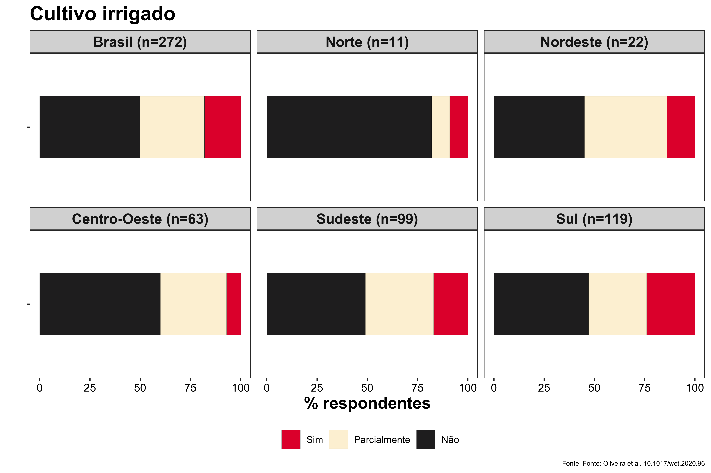
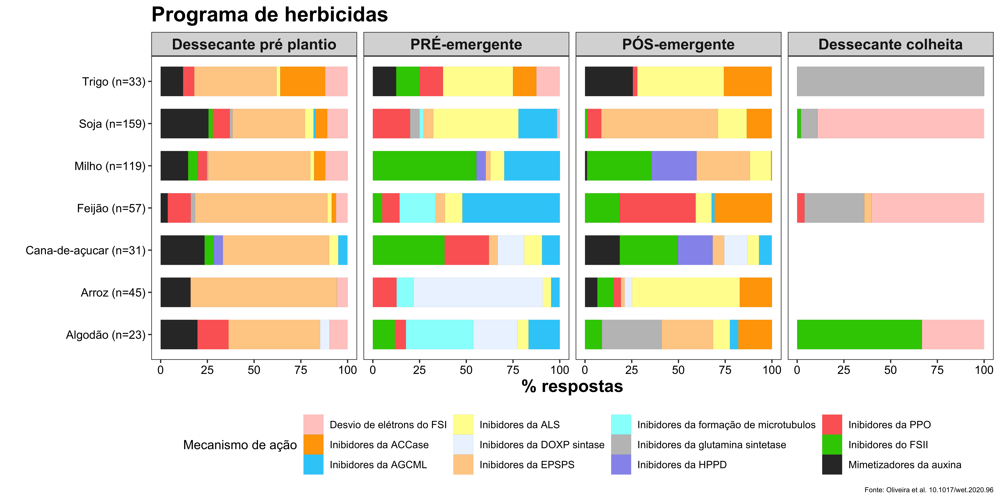
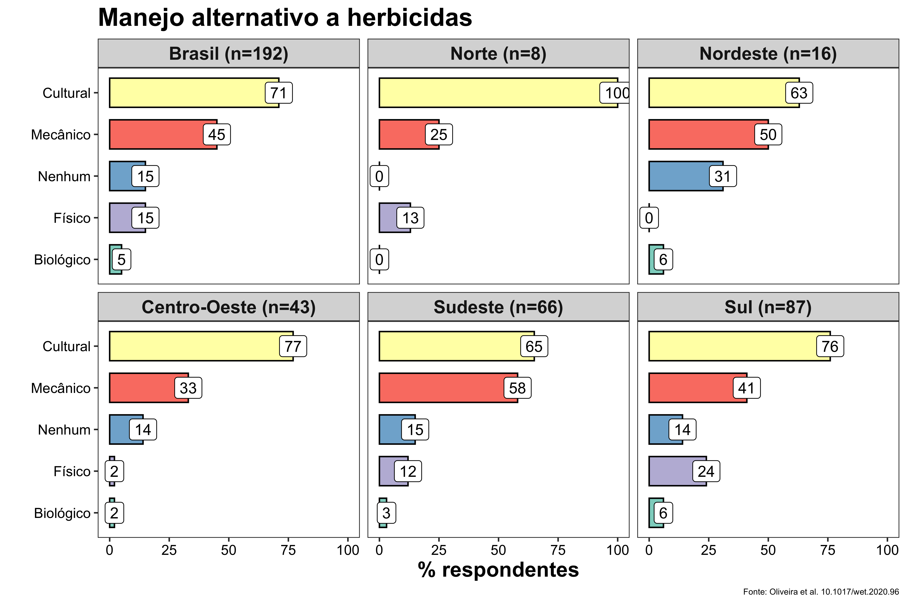
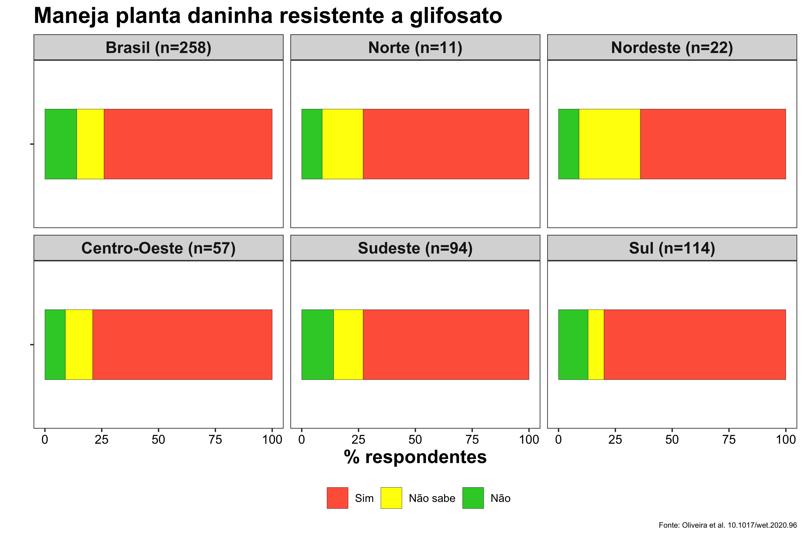
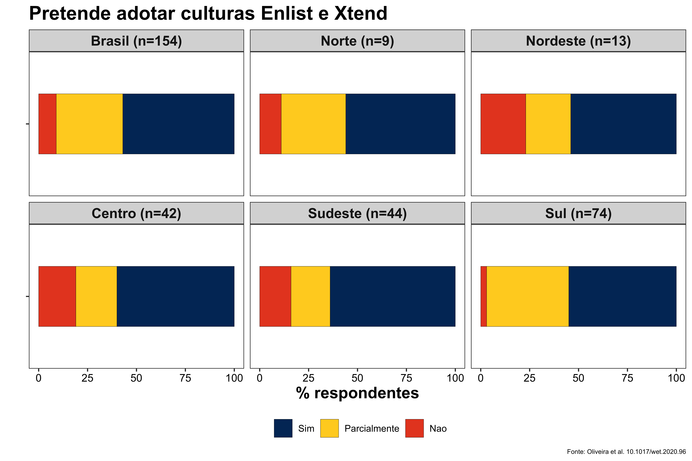
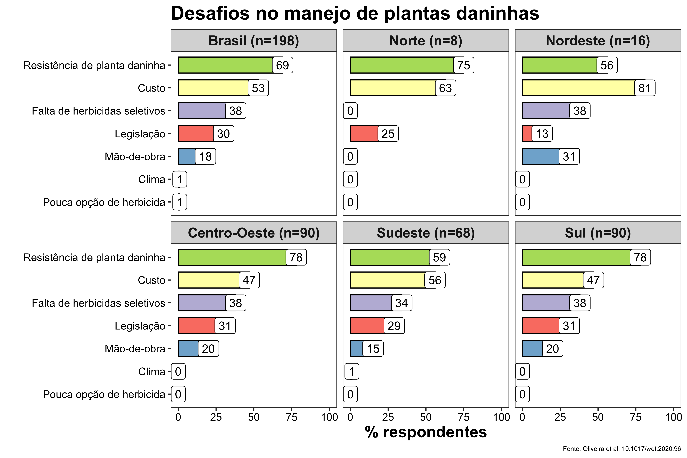

Por Maxwel Coura Oliveira e Rodrigo Werle.

Em 2018 iniciamos um projeto com um [questionário sobre o manejo de culturas e plantas daninhas no Brasil](https://maxweeds.rbind.io/pt/post/survey-2018/). O questionário teve aproximadamente 350 participantes de todas as regiões do Brasil. As respostas dos participantes foram analisadas e o resultado acabou de ser publicado na revista [Weed Technology](https://www.cambridge.org/core/journals/weed-technology), da Sociedade Americana de Plantas Daninhas:


 
**RESUMO**

> Um questionário foi conduzido entre abril e junho de 2018 para entender as percepções das partes interessadas e os desafios sobre os sistemas de cultivo e manejo de plantas daninhas no Brasil. As culturas dominantes manejadas pelos respondentes do questionário foram soja (73%) e milho (66%). Aproximadamente 75% dos respondentes cultivaram ou manejam sistemas de cultivo anual com duas a três safras cultivadas por ano em sucessão. Dezoito por cento dos entrevistados manejam apenas sistemas de cultivo irrigado e mais de 60% dos entrevistados adotam o plantio direto como prática padrão. De acordo com os entrevistados, as cinco principais espécies de plantas daninhas problemáticas nos sistemas de cultivo brasileiros são a buva, a capim-amargoso, a corda-de-viola, o capim-pé-de-galinha e a trapoeraba. Entre as nove espécies documentadas com resistência ao glifosato no Brasil, a buva e o capim amargoso foram relatadas como as plantas daninhas mais preocupantes. Além do glifosato, 31 e 78% dos entrevistados manejam plantas daninhas resistentes ao inibidor da acetil-CoA carboxilase (ACCase) e / ou ao inibidor da acetolactato sintase (ALS), respectivamente. Além dos herbicidas, 45% dos entrevistados usam estratégias de controle de plantas daninhas mecânicas e 75% usam estratégias culturais (por exemplo, culturas de cobertura, plantio direto, rotação / sucessão de culturas). Sessenta e um por cento dos entrevistados adotam culturas de cobertura para suprimir plantas daninhas e melhorar as propriedades físicas e químicas do solo. Aproximadamente 60% dos respondentes da pesquisa pretendem adotar as culturas resistentes ao dicamba (Xtend) ou 2,4-D (Enlist), quando disponíveis. Os resultados apresentados nesse trabalho podem ajudar os profissionais, acadêmicos, indústria e formuladores de políticas a entender melhor o que há de bom e ruim nos atuais sistemas de cultivo e práticas de manejo de plantas daninhas adotadas no Brasil, e ajustar as prioridades e necessidades de pesquisa, educação e tecnologias no futuro.


Primeiramente gostaria de agradecer a todos que participaram respondendo e compartilhando o questionário em 2018. Também gostaria de agradecer os co-autores do projeto: André da Rosa Ulguim (professor da [Universidade Federal de Santa Maria - UFSM](https://www.ufsm.br)) e Anelise Lencina (pós-graduanda da UFSM).


As respostas foram excelentes e o resultado do projeto foi um sucesso. O artigo ainda está no prelo da revista mas já é possivel baixá-lo no site da Weed Technology:

```{r echo=FALSE, out.width=500, fig.align='center'}
knitr::include_graphics("https://media.giphy.com/media/kC3Z2WuxtXO8DyCUzG/giphy.gif")
``` 

<center>
[Clique aqui](https://doi.org/10.1017/wet.2020.96) para baixar o artigo

</center> 

Acredito que a grande maioria não consegue baixar o artigo, pois é necessário ter o acesso via pagamanto ou via Sociedade Americana de Plantas Daninha. Mas não se preocupe, quem tiver interesse em ter o artigo pode me enviar um e-mail: maxweloliveira@unoeste.br, assim que a versão final for publicada eu envio via e-mail para os interessados.

Quando o questionário foi distribuido em 2018, fizemos a promessa de compartilhar os resultados para os respondentes. O objetivo dessa postagem é mostrar de uma forma simplificada e em português os resultados do questionário apresentados no artigo.

Primeiramente eu tenho que explicar que **todos** os dados gerados nesse trabalho **são relacionado apenas as respostas obtidas dos respondentes do questionário**. Por exemplo, a maioria dos respondentes são da região sul (43%) do Brasil, seguida do sudeste (38%), centro-oeste (23%), nordeste (8%), norte (4%). Por isso, as respostas apresentadas nesse trabalho foram estratificadas por regiões do Brasil. O total de hectares manejados pelos respondentes somam 5,4 milhões, que é uma parcela significativa da área agrícola no Brasil. A maioria dos respondentes são agrônomos (69%), respresentantes em empresa (22%), universidade (22%), produtores rurais (21%) e consultores independentes (7%).

Antes de começar:

- As respostas foram organizadas em % de respostas ou % de respondentes

- Algumas perguntas eram de multipla escolha, nesse caso a somatória da % de algumas respostas pode passar de 100%

- Como mencionado anteriormente, os dados foram agrupados por regiões brasileiras

- As respostas estão agrupadas em **Manejo de Sistemas de Cultivo** e **Manejo de Plantas Daninhas**

- Nessa postagem o resultado é apresentado com a pergunta e a resposta em forma figura. Sendo a figura auto explicativa

# Manejo de sistemas de cultivo


Nessa primeira parte estão as perguntas e respostas relacionadas aos sistemas de cultivo:

```{r echo=FALSE, out.width=600, fig.align='center'}
knitr::include_graphics("https://media.giphy.com/media/IfsxP5r7WmhP5P6seN/giphy.gif")
``` 


## 1) Culturas manejadas

```{r echo=FALSE, out.width=1000, fig.align='center'}
knitr::include_graphics("culturas.png")
``` 

## 2) Adoção do sistema de plantio direto

```{r echo=FALSE, out.width=1000, fig.align='center'}
knitr::include_graphics("plantiodireto.png")
``` 


## 3) Adoção do sistema de culturas em sucessão

```{r echo=FALSE, out.width=1000, fig.align='center'}
knitr::include_graphics("safras.png")
``` 


## 4) Adoção do sistema de integração lavoura-pecuária

```{r echo=FALSE, out.width=1000, fig.align='center'}

``` 

## 5) Adoção do sistema de cultivo irrigado

```{r echo=FALSE, out.width=1000, fig.align='center'}

``` 

-------------------------------------------------------------------------------------

# Manejo de plantas daninhas

Nessa segunda parte estão as perguntas e respostas relacionadas ao manejo de plantas daninhas:

```{r echo=FALSE, out.width=600, fig.align='center'}
knitr::include_graphics("https://media.giphy.com/media/pJSKQUb0ytPKo/giphy.gif")
``` 


## 1) Plantas daninhas mais problemáticas

```{r echo=FALSE, out.width=1000, fig.align='center'}
knitr::include_graphics("daninhas.png")
``` 


## 2) Programa de herbicidas para o manejo de plantas daninhas

```{r echo=FALSE, out.width=1000, fig.align='left'}

``` 

## 3) Métodos alternativos (além dos herbicidas) de manejo de plantas daninhas

```{r echo=FALSE, out.width=1000, fig.align='center'}

```


## 4) Manejo de resistência ao glifosato


```{r echo=FALSE, out.width=800, fig.align='center'}

```

## 5) Espécies de plantas daninhas resistentes ao glifosato

```{r echo=FALSE, out.width=1000, fig.align='center'}
knitr::include_graphics("GlyR.png")
```


## 6) Plantas daninhas resistentes a outros herbicidas (além do glifosato)


```{r echo=FALSE, out.width=800, fig.align='center'}
knitr::include_graphics("HRyn.png")
```

## 7) Mecanismos de ação de herbicidas das plantas daninhas resistentes

```{r echo=FALSE, out.width=1000, fig.align='center'}
knitr::include_graphics("Resistencia.png")
```

## 8) Pretende adotar culturas Enlist (resistência ao 2,4-D) / Xtend (resistência ao dicamba)

```{r echo=FALSE, out.width=1000, fig.align='center'}

```


## 9) Responsável pela aplicação de herbicidas


```{r echo=FALSE, out.width=1000, fig.align='center'}
knitr::include_graphics("aplicador.png")
```


## 10) Treinamentos com o responsável pela aplicação de herbicidas

```{r echo=FALSE, out.width=1000, fig.align='center'}
knitr::include_graphics("treinamento.png")
```


## 11) Os principais desafios no manejo de plantas daninhas

```{r echo=FALSE, out.width=1000, fig.align='center'}

```


------------------------------------------------------------------

Se você chegou até o fim pode também ter o interesse de citar nosso trabalho. Fique a vontade para usar nossas figuras. Mas não esqueça de citar: 

> Oliveira MC, Lencina A, Ulguim A, Werle R (2020) Assessment of crop and weed management strategies prior to introduction of auxin-resistant crops in Brazil. Weed Technology, no prelo (DOI: [https://doi.org/10.1017/wet.2020.96](https://doi.org/10.1017/wet.2020.96))


Texto escrito por Maxwel Coura Oliveira e [Rodrigo Werle](https://www.wiscweeds.info)


