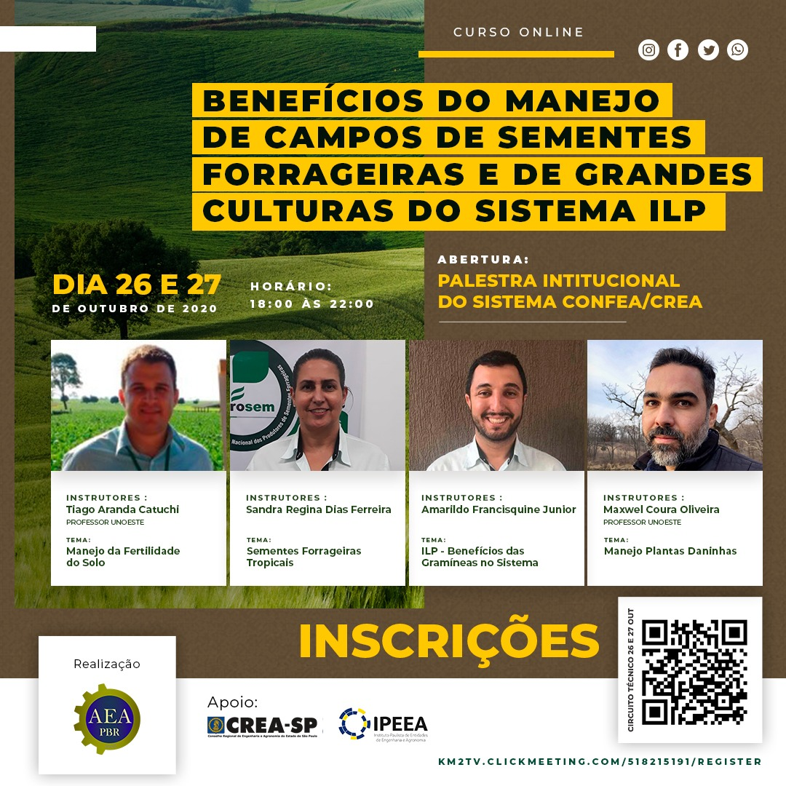

> Este workshop foi organizado pela Associação dos engenheiros Agrônomos de Presidente Bernardes com apoio do CREA-SP e IPEEA. 

Nesta palestra, falei sobre os centeitos básicos de plantas daninhas e os processos que levam a invasão de plantas daninhas/invasoras em sistemas de cultivo, especialmente em gramíneas forrageiras. Assim como técnicas de manejo integrado de plantas daninhas/invasoras em gramíneas forrageiras.

